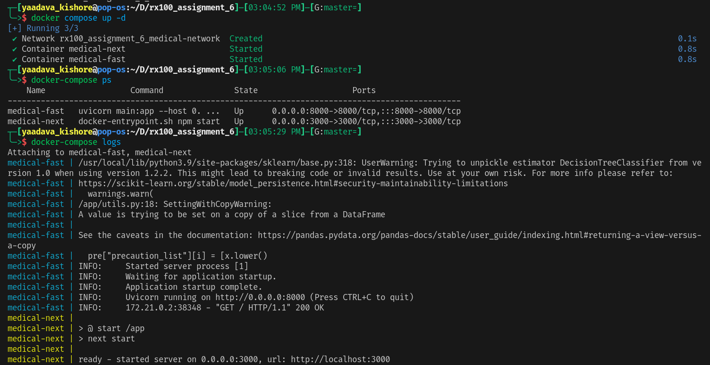
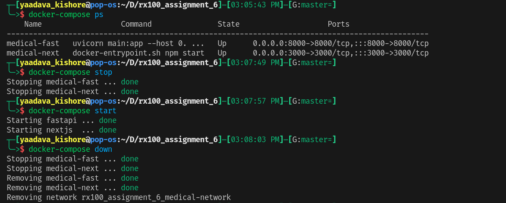

# **Medical Diagnosis App**

> <code>**Created as a part of DS250 course.**</code>

> <code>**Now as part of stnt2 assignment, Dockerized the entire frontend and backend.**</code>

> <code>**Now you can run the project with just one command: "docker-compose up".**
>
> 1. Go to localhost:3000 in your machine to see frontend.
> 2. Go to localhost:8000/docs to see backend(fastapi's openapi spec docs).
>
> **You can stop with "docker compose down".** > </code>

### **Compose Workflow**

> **docker compose's up, ps and logs commands**

> **docker compose's stop, start and down commands**

### **In this project:**

1. **we took a dataset from <a href="https://www.kaggle.com/itachi9604/disease-symptom-description-dataset/code">Kaggle</a> dealing with Disease Symptom Prediction.**

2. **Then we trained a decision tree classifier on it.**

3. **Later we deployed it in an web based application.**

4. **As of now you can run the total web app(both frontend and backend) in your localhost.**
